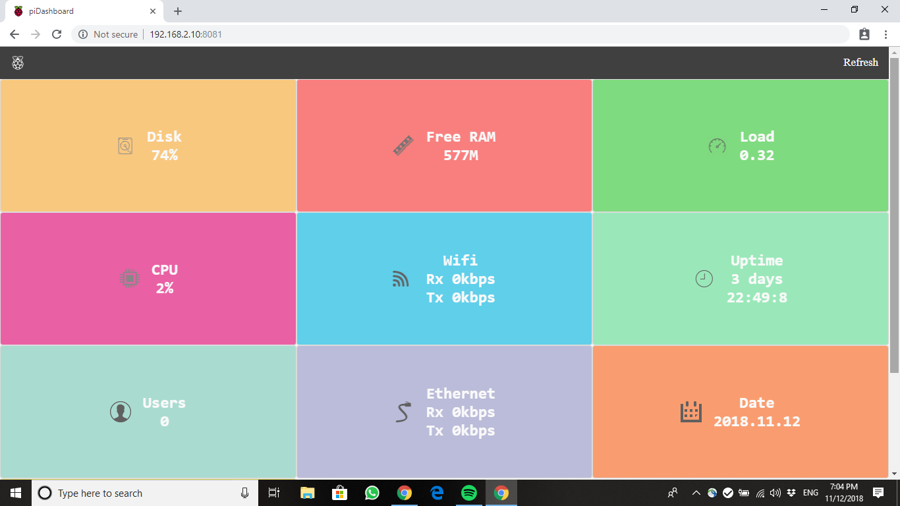
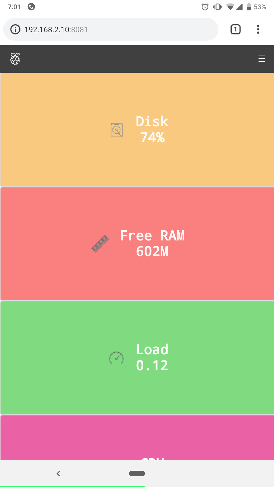

    

# piDashboard
piDashboards provide at-a-glance views of relevant KPIs (key performance indicators) of the host system. It is updated periodically and can be accessed via web based interface. 

# Project Structure
    .
    ├── configuration
    ├── php
    ├── public_html
    │   ├── css
    │   ├── images
    │   ├── js
    │   └── proxy
    └── snapshot

# Snapshots

## Desktop Home Page

## Mobile Home Page

